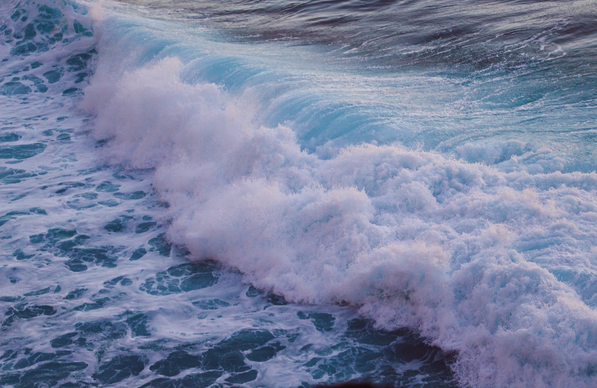
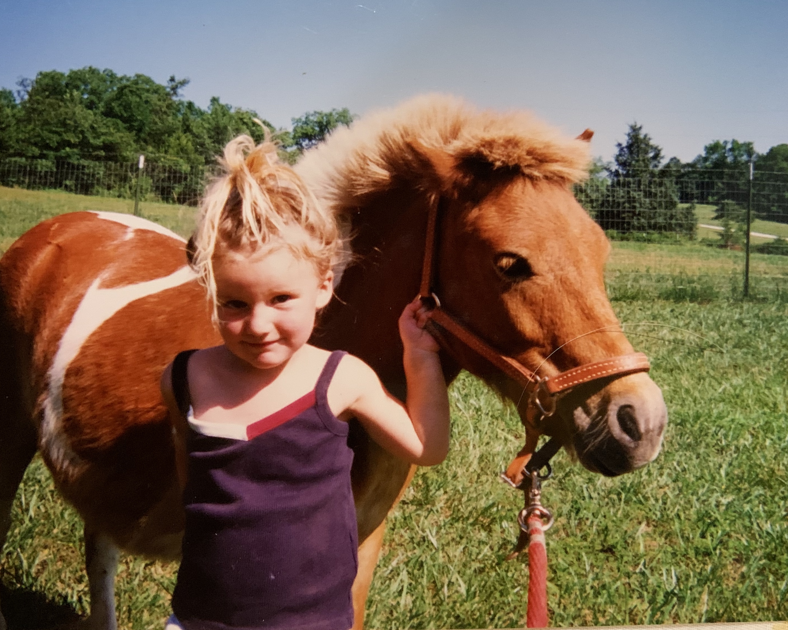
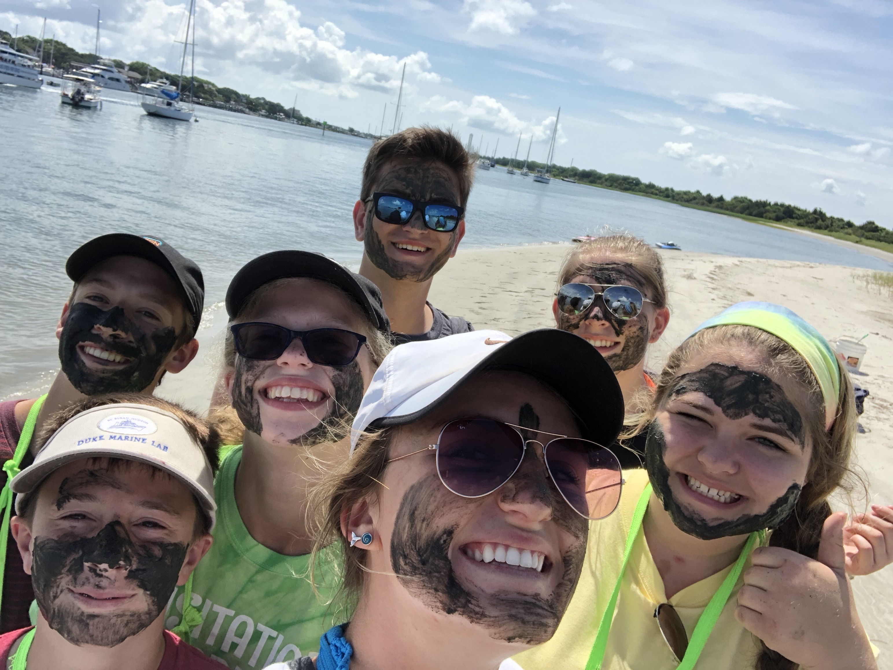
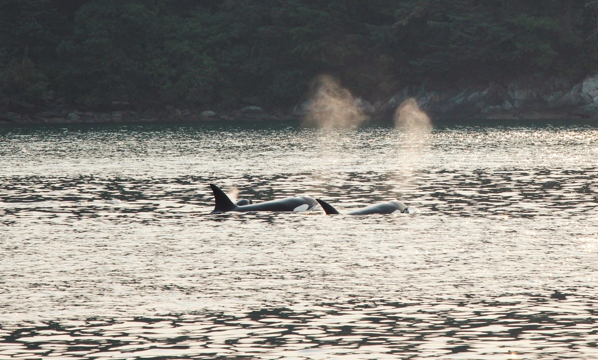
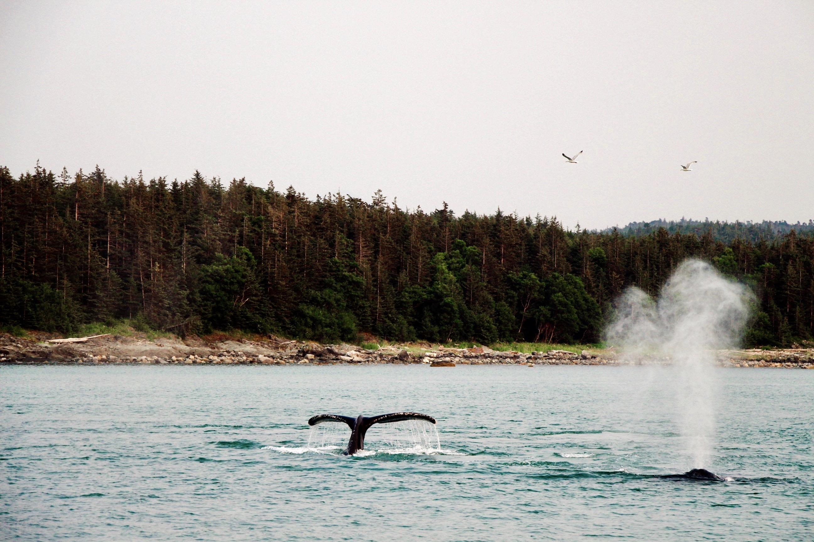

```{r setup, include=FALSE}
knitr::opts_chunk$set(echo = FALSE)

library(tidyverse)
library(here)
```



### First a little introduction

I grew up in a small town outside of St. Louis, Missouri. From an early age I had a love for the outdoors and the environment. Early on I decided that I wanted to be a marine scientist, and took every opportunity to learn more about science and the ocean. 




### Undergraduate experience

I studied marine science and economics at the University of South Carolina, where I quickly became heavily involved on campus through research, student government, and Greek life. My first research experience was in a climate change lab studying the bioavailability of Arctic soils as it relates to global climate change.  I became increasingly interested in the communication of climate change, and moved into a role in the lab where I helped Dr. Lori Ziolkowski grow her social media presence as a climate communicator in South Carolina, where she began giving talks to local churches and community groups about her research and the projected impacts of climate change. While at the University of South Carolina I also had the chance to live abroad in the Galapagos island, where I assisted on numerous different projects tagging juvenile hammerhead sharks, counting sea turtles, and even my own project where I recorded interviews with scientists and residents in the Galapagos about climate change (Available at: https://youtu.be/NHvUVDSLZHo). I also spent my summers teaching highschool students about marine science at the Duke Marine Lab in Beaufort, NC. 





### Wild Alaska 


Upon graduating, I moved to Alaska where I worked on a 78' catamaran and hung out with whales everyday. 





